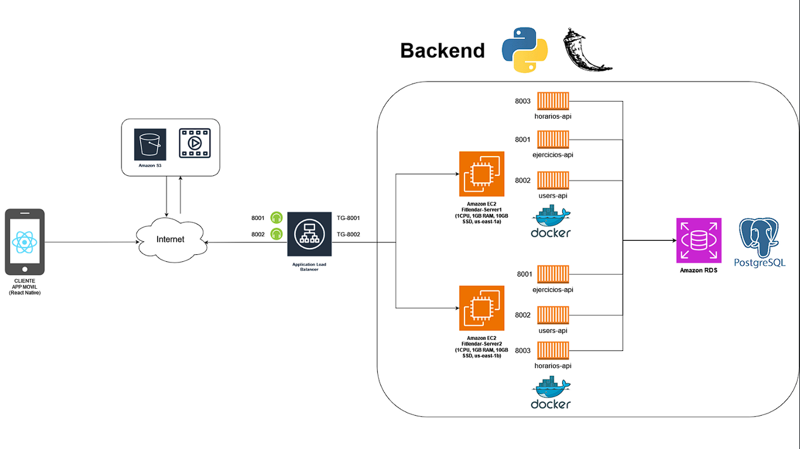

# Proyecto Final de Software

### Integrantes
* Anderson David Cárcamo Vargas
* Mishelle Stephany Villarreal Falcón
* Alejandro Rojas Urquizo
* José Wong
* Luis Cordero
* Cristopher Meneses
* Hans Mendoza

# Análisis

## Problemática
* Muchas veces se presenta la iniciativa de querer hacer ejercicio y estar en buena forma; sin embargo, a veces no tenemos la disponibilidad de tiempo que quisiéramos

## Requisitos
(docs de requisitos)

# Diseño

## Arquitectura

# Implementación

## Components
Dentro de components tenemos a los principales:
* "tabNavigator" que se muestra al ingresar a la aplicación después de registrarse, para poder navegar por las diferentes vistas
* "main.jsx" contiene un stacknavigator que nos permite de igual manera, navegar entre screens antes de ingresar a la app dentro del main se encuentra: "Login", "Home", "Signup" y "Form registro" que utilizamos básicamente para recolectar info del usuario

## Screens

### Antes de ingresar
* Login (mergeRamas)
* Signup (mergeRamas)
* Form registro(mergeRamas)

### Después de ingresar
* Home (Calendario) (formEvent)
* Ejercicios (mergeRamas)
* Perfil (execirseHotfix)

* Suggestions (ya no habrá)

## Estilos
* calendarioSemanal
* exrciseCardStyle
* exerciseStyle
* loginStyle
* ....

## Funciones Importantes

# Pruebas

# Despliegue

